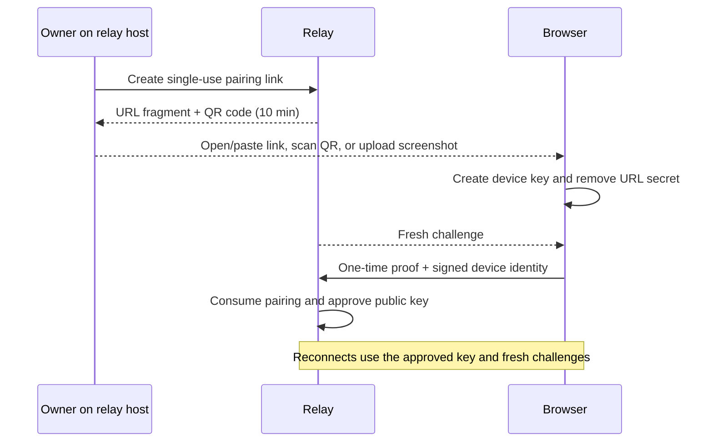

# Security Policy

English | [简体中文](SECURITY.zh-CN.md)

Documentation for **v0.3.0 (2026-09-12)** · [Release and upgrade](release-0.3.0.md) · [Documentation index](README.md)

## Supported versions

Use the latest tagged release or current `main`, and keep the browser, relay, and connector on the same
revision. The protocol is strict and intentionally has no plaintext, missing-capability, or older-version
fallback.

Codex Anywhere is designed for one trusted user. It is not a multi-tenant identity service.

## Desktop task isolation

Mobile delivery binds the native Desktop caller and destination to the same selected task. The bridge
never borrows another existing task as a controller or reply destination. Sending, renaming, and reading
task approval status enforce this boundary before opening the native pipe; invalid identities fail closed.
Only model and reasoning settings can enter delivery overrides, never a task ID, message, or caller.

Desktop may represent mobile input using tool-delivery metadata. Its source task must still be the
destination itself, not another project. Delivery failure never retries through a different task or takes
over a Desktop-owned writer. Tests cover concurrent sends, delayed settings, and rejected identities.

Updating only the ECS relay does not update a Windows connector: rebuild and restart the PC connector
too. This correction prevents new cross-task delivery; it does not erase previously misdelivered messages
or repair a model's existing context. Preserve incident evidence and review affected tasks before reusing
them for sensitive work; do not blindly edit live rollout files or delete unrelated conversation history.

## Report a vulnerability

Use [GitHub private vulnerability reporting](https://github.com/gaotong132/codex-anywhere/security/advisories/new).
Do not put credentials, private addresses, conversation content, or local paths in a public issue.

## What is protected

- Codex, projects, attachments, and generated files stay on the selected connector node. Personal
  computers accept no public inbound connection; a same-host ECS connector uses the relay's loopback entry.
- The relay has no conversation database and does not intentionally persist messages, previews,
  visualizations, or download chunks. It persists device trust state and a separate private mode-0600
  snapshot containing device IDs, roles, connection counts, and last connected/seen timestamps. The
  activity snapshot contains no keys, IP addresses, or content and has no public query endpoint. Only
  the Relay writes activity, separately from administrator approvals and revocations.
- A browser enrolls through a ten-minute, single-use pairing link, then authenticates with its approved
  Ed25519 key. There is no shared browser token or recovery login.
- Every connector needs its connector-only secret and a separately administrator-approved Ed25519
  identity. Windows protects both connector credentials with current-user DPAPI. The Linux installer uses
  a mode-0600 systemd environment file and a mode-0600 identity under the service account.
- Browser and connector authenticate ephemeral X25519 keys, then protect application frames with
  XChaCha20-Poly1305. The relay routes ciphertext and can see metadata, timing, and approximate size—not
  message or file content.
- Authentication uses fresh challenges, expires authenticated sockets after one hour by default, throttles
  repeated failures, validates browser origins, and limits frame size.

The browser private key is stored in that browser profile. Browser storage is not a hardware-backed
keystore; anyone who compromises the profile can act as that browser until the device is revoked.

## Pairing flow

The experimental side panel permits embedding only at `/extension/sidepanel` by an exact allowlisted extension
Origin; normal pages remain non-embeddable. Chat and extension keep separate device identities. The Web-to-panel
interface carries only environment/Session selection and online state, never private keys or page execution
commands. Authorization requires a user click in extension UI and validates the real window, tab, document,
and current connector environment.
The extension uses `tabs` for active-tab metadata and requests optional access to the current site on the user's
authorization click. Chrome may retain this site permission, which also supports AI-created same-origin children;
actual Session/document grants still require an explicit click and never adopt other manually opened tabs.
Explicit new-page consent can replace this extension's old root, or another browser's grant tree when every page has
missed heartbeats for 45 seconds. Old grants, children, late results, and recovery attempts lose authority; no old-browser
page content is read. A fresh heartbeat anywhere in another browser's tree prevents replacement.

The pairing credential is carried in the URL fragment, removed before the WebSocket connects, and stored
by the relay only as a one-way verifier until it expires or is consumed.
Opening a link prefills an editable form and requires a click to pair. New pending credentials stay only
in page memory, not browser storage. Cancellation, failure, or the 15-second authentication deadline stops
the attempt; callbacks from a replaced socket cannot authenticate or modify the next attempt. Reconnection
after successful enrollment still uses the approved device key.



Side-panel chat pairs once and sponsors a separate extension identity using a connection-bound signature. Private keys
remain separate. Revoking the sponsoring Web device also revokes its linked extensions; explicit revocation prevents
automatic re-enrollment. Device pairing does not authorize page control.

Connectors do not use browser pairing. Their first signed connection appears as pending and must be
reviewed from the relay host with `./scripts/relay.sh approve`. Adding a second execution environment never
inherits trust from the first one.

## Files, previews, and approvals
Generated-image summary hydration reads only the known session rollout, in 512 KiB chunks with a 64 MiB scan cap,
and caches local references keyed by file identity and modification metadata. It does not fetch complete image tool
results through summary RPCs. A displayed reference never bypasses canonical-path, regular-file, MIME or preview-size checks.


- Image previews must resolve inside an allowed root, pass content validation, and are resized and
  converted to WebP before transfer.
- Original file downloads require user confirmation and an in-memory capability bound to one approved
  browser identity and one unchanged file. The capability expires after 30 minutes without progress and
  is not stored by the relay. The Web client tries to keep the screen awake; while hidden or disconnected,
  it stops requesting new chunks and resumes after the same browser reconnects.
- Local text previews require an explicit click, accept only allowlisted Markdown, source, config, or
  plain-text names, and must resolve inside a configured allowed root. The connector resolves the
  canonical file path, requires a regular UTF-8 file no larger than 2 MiB, rejects embedded NUL bytes and
  changing snapshots, and intentionally excludes sensitive extensions such as `.env`, `.pem`, and `.key`.
- Source previews load the common syntax-highlighting runtime only when needed. Highlighted markup is
  sanitized to classed `span` elements before insertion; unavailable languages and inputs above 512 KiB
  fall back to escaped plain code. Every preview retains the separately confirmed download path without
  sending file contents through the relay in plaintext.
- Per-turn diffs require an explicit click and are resolved only from the rollout path already associated
  with an allowed session. The connector streams that rollout, isolates the requested turn, and returns at
  most 512 KiB through the end-to-end encrypted channel. The relay does not store diff content, and the
  connector never substitutes the current working-tree diff when an historical turn cannot be recovered.
- Mermaid code blocks load the renderer on demand with strict security and bounded input and edge counts.
  Generated SVG is sanitized again before inline display and uses an explicit high-contrast dark theme;
  invalid diagrams fall back to their source code.
- Visualization cards remain limited to Codex visualization roots. Explicitly opened `.html`/`.htm`
  file links use the bounded text reader and an opaque-origin sandbox. The relay serves only an empty
  renderer; decrypted HTML goes directly into the frame over a private browser message channel.
  Inline CSS/JavaScript can run, but application storage, top navigation, popups, forms and automatic
  network requests are blocked. Standalone external or local CSS/JS files are not bundled.
  Up to 100 declared local raster images load near the viewport through the existing root/MIME checks,
  with three concurrent reads and a 32 MiB encoded-data budget. Up to 200 local links can be opened by
  a real user click, retaining source/download controls and up to 20 back-navigation entries.
- Timeline diagnostics expose only aggregate tool counts, bounded public failure details, model settings,
  and context totals. Raw reasoning, tool arguments and output, encrypted compaction content, and rate-limit
  payloads are not rendered. Completed approval markers use a reduced action summary instead of replaying
  the full approval request.
- The Web UI can act only on approvals owned by connector-started turns. An approval already owned by
  Codex Desktop stays on the computer and is shown as non-actionable in the Web UI.
- The Web stop control is limited to the matching turn owned by the selected connector and uses the
  app-server interrupt operation. Desktop-owned work remains controlled on the computer; stopping never
  falls back to killing a process or archiving a task.
- Headless tasks expose user approval and Codex auto-review modes. Full access is available only when the
  connector operator explicitly enables it; selecting it requires a second browser confirmation and sends
  `never` plus `dangerFullAccess` to Codex. This controls the Codex sandbox independently of file-preview policy.
- The selected connector route is part of the authenticated secure-channel transcript. Switching routes
  destroys the browser's old channel, rejects its pending requests, and keeps session selection, unread
  state, workspace memory, and attachment lookup scoped to the new environment. A task already accepted by
  the old node continues there and is resynchronized when the user switches back.
- Desktop activity statuses are kept only as a short-lived in-memory connector cache. They are optional
  enrichment and are not persisted by the relay or allowed to block the app-server session list.

Broad `-AllowedRoots`, `-AllowAnyFileDownload`, `-EnableNetworkAccess`, and `-AllowFullAccess` options increase connector
authority and are disabled or narrow by default. `-AllowAnyFileDownload` expands only confirmed downloads;
text and raster previews retain their allowed-root checks. Full access also allows Codex operations beyond read-only preview, subject to the connector service account’s OS permissions.

## Trust boundary and honest limits

The ECS/VPS is trusted infrastructure because it serves the Web application and manages device trust.
A compromised relay administrator can replace future Web code or trust records, approve an attacker,
observe metadata, or deny service. A compromised connector node or approved browser profile retains that
endpoint's authority. When the relay host also runs the ECS connector, the host administrator can directly
access that connector's credentials, Codex account, and ECS workspaces; end-to-end encryption only isolates
the relay process from application frames. It does not make the deployment zero-trust.

Direct `ws://` is supported and application frames remain encrypted, but HTTP/WS does not protect Web
delivery, pairing, metadata, or availability from the network. Prefer WSS, a VPN, or a secure tunnel on
untrusted networks.

Codex Anywhere does not defend against a harmful Codex action that the user approves, and it does not
replace Codex permission review.

## Deployment baseline

- Keep the reference port bound to ECS loopback and publish it through a maintained ingress or private
  network. Use SSH keys, patch the host, and restrict firewall rules.
- Keep `.env` and the device-registry volume private. Back them up only when the backup is encrypted.
- Keep `/etc/codex-anywhere/connector.env`, the Linux connector identity, the service account's Codex
  credentials, and its workspace roots private. Do not use the whole home directory as an allowed root.
- Set `BRIDGE_TRUST_PROXY=1` only when a trusted proxy is the sole ingress and overwrites `X-Real-IP`.
- Disable proxy access logs or retain them briefly; relay container logs are size-bounded by default.
- Approve only a request you just initiated. Revoke lost, retired, or unexpected devices.
- Rotate any secret exposed in chat, screenshots, logs, shell history, commits, or CI output.

## Device administration

Run on the relay host:

```bash
./scripts/relay.sh pair https://codex.example.com
./scripts/relay.sh devices
./scripts/relay.sh revoke
```

The running relay reloads the registry and closes a revoked connection, normally within 30 seconds.

## If access may be compromised

1. Revoke the affected browser or connector. Treat a copied device private key as a compromised endpoint.
2. If the connector secret leaked, replace `BRIDGE_CONNECTOR_TOKEN`, reinstall every connector credential,
   and restart the relay and all connectors.
3. Review the ECS, ingress, browser extensions, clipboard, shell history, and related infrastructure
   credentials. Do not publish forensic data that contains conversation or identity material.
