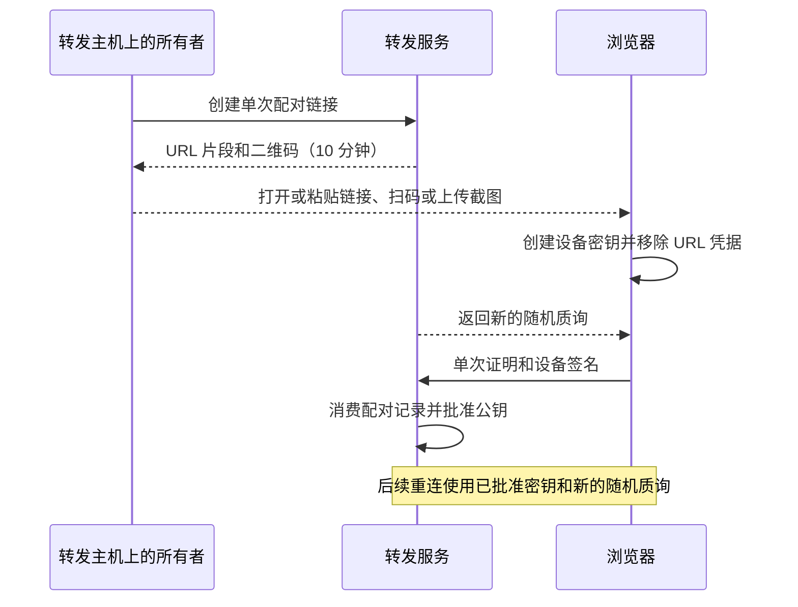

# 安全策略

[English](SECURITY.md) | 简体中文

文档对应 **v0.3.0（2026-09-12）** · [发布与升级](release-0.3.0.zh-CN.md) · [文档索引](README.zh-CN.md)

## 支持版本

请使用最新 Tag 或当前 `main`，并让浏览器、转发服务和连接器保持同一提交。协议采用严格版本，不提供
明文、缺失能力或旧版本回退。

Codex Anywhere 面向一个可信用户，不是多租户身份服务。

## Desktop 会话隔离

手机消息投递时，原生 Desktop 调用的来源与目标必须绑定到同一个选中会话。桥接不能借用其他已有会话
作为控制器或回信目的地。发送、重命名和读取会话审批状态都会在打开原生管道前检查这一边界，身份
无效时直接拒绝。投递覆盖项只允许模型和思考强度，不允许覆盖会话 ID、正文或来源。

Desktop 可能用工具投递元数据表示手机输入，但来源必须是目标会话自身，不能是另一个项目。投递失败
不会改用其他会话重试，也不会接管 Desktop 已持有的写入者。测试覆盖并发发送、设置异步返回和身份拒绝。

只更新 ECS 转发服务不会更新 Windows 连接器，PC 连接器也必须重新构建并重启。此修复阻止新的跨会话
投递，不会清除已误发的消息或修复模型已有上下文。应保留事件证据，并在敏感工作继续前审查受影响会话；
不要直接改写正在使用的 rollout 文件，也不要删除无关的正常会话历史。

## 报告漏洞

请使用 [GitHub 私密漏洞报告](https://github.com/gaotong132/codex-anywhere/security/advisories/new)。
不要在公开 Issue 中包含凭据、私有地址、会话内容或本机路径。

## 当前保护范围

- Codex、项目、附件和生成文件都留在当前选择的连接器节点；个人电脑不接受公网入站连接，同机 ECS
  连接器使用转发服务的回环入口。
- 转发服务没有会话数据库，也不会有意持久化消息、预览、可视化或下载分块。它保存设备信任状态，另以
  权限为 0600 的私有快照保存设备 ID、角色、连接数与最近连接/最后在线时间；活跃快照不含密钥、IP 或
  内容，不提供公网查询接口。Relay 单独写活跃文件，避免覆盖管理员的批准或撤销操作。
- 浏览器通过十分钟单次链接注册，之后使用已批准的 Ed25519 密钥认证；不存在共享浏览器 Token 或
  恢复登录。
- 每个连接器同时需要连接器专用密钥和单独经过管理员批准的 Ed25519 身份。Windows 使用当前用户
  DPAPI 保护两类凭据；Linux 安装器使用权限为 0600 的 systemd 环境文件和服务账号下的 0600 身份文件。
- 浏览器和连接器验证临时 X25519 密钥，再用 XChaCha20-Poly1305 保护应用帧。转发服务只能路由密文，
  能看到元数据、时间和大致大小，但看不到消息或文件内容。
- 认证使用新的随机质询；已认证连接默认一小时后失效；重复失败会被限速；同时检查浏览器来源和帧大小。

浏览器私钥保存在对应浏览器配置中，不是硬件安全存储。浏览器配置被攻破后，攻击者可以冒充该浏览器，
直到设备被撤销。

## 配对流程

实验性侧栏仅在 `/extension/sidepanel` 入口允许白名单中的精确扩展 Origin 嵌入；普通页面仍禁止嵌入。
聊天与插件分别保留设备身份。网页到插件仅传递当前环境/会话及在线状态，不传递私钥或页面执行命令；
授权由插件界面的用户点击触发，并校验实际窗口、标签页、文档身份和当前连接环境。
插件使用 `tabs` 权限读取活动标签页地址，点击授权时才请求当前站点的可选访问权限。站点权限可由浏览器
持久保存，也支持 AI 创建的同源子页；实际会话/文档授权仍需显式点击，手动打开的其他页签不会自动纳管。
明确授权新页可撤销本插件在该会话的旧起始页，或整组页面超过 45 秒无心跳的旧浏览器授权。旧授权和子页
立即失效，迟到回包及旧授权恢复被拒绝；不会读取旧浏览器的页面内容。其他浏览器仍有新鲜心跳时拒绝替换。

配对凭据位于 URL 片段中，WebSocket 连接前会从地址栏移除；转发服务只保存单向校验值，过期或消费
后即删除。
打开链接会自动填入可编辑的配对框，点击确认后才发起配对；新的待配对凭据只保留在页面内存中，
不写入浏览器存储。取消、失败或超过 15 秒认证期限都会结束本次尝试；旧连接的回调不能认证或改变
下一次尝试。成功配对后的自动重连仍使用已批准的设备密钥。



侧栏聊天配对一次，通过绑定本次连接的签名关联独立插件身份，私钥仍分别保存。撤销 Web 设备会级联撤销其关联插件；
显式撤销会阻止自动重新登记。设备配对本身不授予页面控制权限。

连接器不使用浏览器配对。它首次发起签名连接后会进入待批准状态，必须在转发主机执行
`./scripts/relay.sh approve` 审核；新增第二个执行环境不会继承第一个连接器的信任。

## 文件、预览与审批
生成图片摘要补全只读取已关联的任务记录，每块 512 KiB、扫描上限 64 MiB，按文件身份和修改信息缓存本地图片引用，
不通过摘要 RPC 拉取完整图片工具结果。识别出引用不等于放宽权限，预览仍需通过规范路径、普通文件、MIME 与大小检查。


- 图片预览必须位于允许根目录内，通过内容校验后缩放并转换为 WebP 再传输。
- 原文件下载需要用户确认，并使用仅存于内存、绑定单个已批准浏览器身份和未变更文件的能力凭证。
  30 分钟没有进度后凭证失效，且转发服务不会存储文件。Web 端会尝试保持屏幕常亮；页面隐藏或断联时
  不再请求新分块，回到前台并由同一浏览器重连后续传。
- 本机文本预览必须由用户点击触发，只接受白名单内的 Markdown、源代码、配置或纯文本文件名，并且必须解析到已配置的允许根目录内。连接器会解析规范文件路径，只接受不超过 2 MiB 的普通 UTF-8
  文件，拒绝内嵌 NUL、读取期间发生变化的文件，以及 `.env`、`.pem`、`.key` 等敏感扩展名。
- 源代码预览只在需要时加载常用语法着色运行时。高亮结果只允许带 class 的 `span`，再次清洗后才会
  插入页面；语言不可用或输入超过 512 KiB 时回退为转义后的纯代码。每个预览都保留独立确认的下载
  入口，文件内容不会以明文经过转发服务。
- 按轮次查看 Diff 必须由用户点击触发，并且只能从已关联到允许会话的 rollout 路径解析。连接器流式
  读取记录、隔离指定轮次，最多通过端到端加密通道返回 512 KiB；转发服务不存储 Diff。历史轮次无法
  恢复时不会改用当前工作区 Diff，以免混入其他修改。
- Mermaid 代码块按需加载渲染器，启用严格安全模式并限制输入大小和边数；生成的 SVG 再次清洗后以
  高对比深色主题内联显示，语法错误时回退为源代码。
- 可视化卡片仍限 Codex 可视化目录；用户明确点击的 `.html`/`.htm` 文件链接使用有界文本读取与不透明来源沙箱。
  转发服务仅提供空白渲染容器，解密后的 HTML 通过浏览器私有消息通道直接进入预览，不经过服务器明文接口。
  允许内嵌 CSS/JavaScript，禁止访问应用存储、顶层导航、弹窗、表单和自动联网；不打包外部或本机独立 CSS/JS 文件。
  最多 100 张已声明的本机位图在靠近可视区域时通过既有根目录与 MIME 检查加载，并发为 3、编码后总量上限 32 MiB。
  最多 200 个本机链接由真实点击打开，保留源码、下载入口与最多 20 层返回记录。
- 时间线诊断只展示工具数量汇总、有界的公开失败原因、模型配置和上下文总量，不展示原始推理、工具参数
  与输出、加密的上下文压缩内容或限流载荷。审批完成标记使用精简的操作摘要，不回放完整审批请求。
- Web 端只能处理连接器发起轮次所持有的审批。Codex Desktop 已持有的审批继续留在电脑上，Web 只会
  显示不可操作状态。
- Web 停止按钮只对当前选中连接器持有、且线程身份匹配的轮次生效，并使用 app-server 官方中断。
  Desktop 已持有的任务仍需在电脑上控制；停止操作不会退化成杀进程或归档任务。
- 无头会话支持用户审批和 Codex 自动审查。只有连接器管理员显式开启后才能选择“完全访问权限”；浏览器
  还会二次确认，并向 Codex 设置 `never` 与 `dangerFullAccess`。这控制 Codex 沙箱，与文件预览策略相互独立。
- 当前连接器路由是安全通道认证记录的一部分。切换路由时，浏览器会销毁旧通道、拒绝旧环境的待处理
  请求，并按新环境隔离会话选择、未读状态、最近工作目录和附件查找。旧节点已经接受的任务会继续执行，
  切换回来后再同步状态。
- Desktop 活动状态只保存在连接器内存中的短期缓存里，属于可选补全；转发服务不会持久化，也不能让它
  阻塞 app-server 会话列表。

扩大 `-AllowedRoots`，或者启用 `-AllowAnyFileDownload`、`-EnableNetworkAccess`、`-AllowFullAccess`，都会增加连接器权限；
这些选项默认关闭或保持最小范围。`-AllowAnyFileDownload` 只扩大确认下载范围，不改变文本或位图预览的根目录检查。“完全访问权限”还允许 Codex 执行只读预览以外的操作，仍受连接器服务账号的操作系统权限约束。

## 信任边界与实际限制

ECS/VPS 是可信基础设施，因为它负责提供 Web 应用和管理设备信任。转发主机管理员被攻破后，攻击者
可以替换后续 Web 代码或信任记录、批准恶意设备、观察元数据或拒绝服务。连接器节点或已批准浏览器
配置被攻破后，也会继承该端权限。当转发主机同时运行 ECS 连接器时，主机管理员可以直接访问该连接器
凭据、Codex 账号和 ECS 工作区；端到端加密只让转发进程看不到应用帧，不能把部署变成零信任架构。

项目支持直接 `ws://`，应用帧仍会加密，但 HTTP/WS 无法保护 Web 分发、配对、元数据和可用性。
经过不可信网络时，优先使用 WSS、VPN 或安全隧道。

Codex Anywhere 不能防御用户主动批准的有害 Codex 操作，也不能替代 Codex 自身权限审查。

## 部署基线

- 参考端口保持绑定 ECS 回环地址，通过持续维护的入口或私有网络发布。SSH 使用密钥，及时更新主机并
  限制防火墙规则。
- `.env` 和设备注册表卷保持私有；只在备份已加密时保存副本。
- 保护 `/etc/codex-anywhere/connector.env`、Linux 连接器身份、服务账号的 Codex 凭据和工作区根目录；
  不要把整个 Home 目录设为允许根目录。
- 只有可信代理是唯一入口并会覆盖 `X-Real-IP` 时，才设置 `BRIDGE_TRUST_PROXY=1`。
- 关闭代理访问日志或缩短保留时间；转发容器日志默认限制大小。
- 只批准自己刚刚发起的请求，及时撤销丢失、停用或意外出现的设备。
- 密钥一旦出现在聊天、截图、日志、Shell 历史、提交或 CI 输出中，应立即轮换。

## 设备管理

在转发主机执行：

```bash
./scripts/relay.sh pair https://codex.example.com
./scripts/relay.sh devices
./scripts/relay.sh revoke
```

运行中的转发服务会重新读取注册表并关闭被撤销的连接，通常不超过 30 秒。

## 怀疑访问权泄露时

1. 撤销受影响的浏览器或连接器；设备私钥被复制时直接视为端点失陷。
2. 连接器密钥泄露时，更换 `BRIDGE_CONNECTOR_TOKEN`，重新安装所有连接器凭据，并重启转发服务和
   全部连接器。
3. 检查 ECS、入口、浏览器扩展、剪贴板、Shell 历史和相关基础设施凭据。不要公开包含会话或身份材料
   的取证信息。
